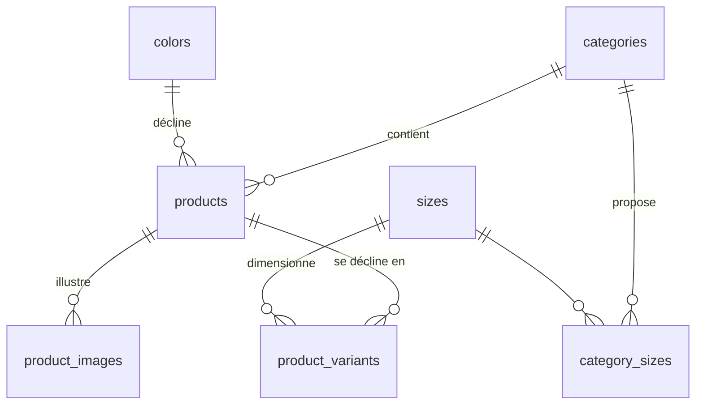

# Schéma catalogue

Source : [`supabase/migrations/0001_catalog.sql`](../supabase/migrations/0001_catalog.sql)
Données de départ : [`supabase/seed.sql`](../supabase/seed.sql)

## Le modèle en une phrase

Un **produit** est un couple *catégorie × couleur* (une fiche = « Bague or »), une
**variante** est la déclinaison achetable de cette fiche. Tout le catalogue étant en
taille unique, chaque fiche a aujourd'hui exactement une variante.

## Pourquoi ce découpage

Le brief demande 36 fiches bijoux **et** un sélecteur de couleur sur la fiche produit.
Deux lectures étaient possibles :

| Option | Fiches | Conséquence |
| --- | --- | --- |
| Produit = catégorie, couleur = variante | 4 | Contredit les « 36 fiches » ; grille boutique à 4 cartes |
| **Produit = catégorie × couleur** (retenu) | **36** | Grille et filtres se lisent directement sur `products` ; le sélecteur de couleur navigue entre fiches sœurs |

Retenu : la seconde. Chaque couleur a sa propre URL (`/produit/bague-or`), ses propres
photos et son propre référencement — ce qu'on veut pour du bijou, où la couleur est
l'argument visuel principal. Le sélecteur de couleur de la fiche est un jeu de liens
vers les produits de la même catégorie (`ProductDetail.siblings`).

## Tables

| Table | Rôle | Lignes au lancement |
| --- | --- | --- |
| `categories` | Rubriques (4 bijoux + lunettes). `has_colors` dit si la catégorie est déclinée en couleurs. | 5 |
| `colors` | Les 9 couleurs, avec `hex` pour les pastilles de filtre. | 9 |
| `sizes` | Tailles génériques. Aucune aujourd'hui : tout est en taille unique. | 0 |
| `category_sizes` | Quelles tailles pour quelle catégorie. Aucune aujourd'hui. | 0 |
| `products` | Une fiche. `category_id` + `color_id` (NULL pour les lunettes). | 38 |
| `product_variants` | Ce qu'on met au panier. `size_id` NULL = variante unique. | 38 |
| `product_images` | Photos, `is_primary` pour la vignette de la grille. | 32 |

Les tailles restent modélisées sans être utilisées. C'est volontaire : le jour où une
catégorie sera déclinée en tailles, il suffit d'ajouter des lignes dans `sizes` et
`category_sizes` et une variante par taille — le sélecteur apparaît alors tout seul sur
la fiche, sans toucher au schéma ni au front.

## Points à connaître

- **Prix en centimes** (`price_cents`), tous à `0` pour l'instant. Le prix vit sur la
  fiche ; `product_variants.price_cents` peut le surcharger (une taille plus chère) et
  vaut `NULL` par défaut = « hérite de la fiche ».
- **SKU** composés depuis les codes courts : `LJ-<catégorie>-<couleur>[-<taille>]`,
  ex. `LJ-BAG-OR`, `LJ-COL-NO`, `LJ-LUN-01`.
- **Photos** : les 32 pièces photographiées (tous les bijoux sauf 4 colliers) sont
  servies depuis `public/produits/`.
  `product_images.url` accepte aussi bien ce chemin qu'une URL absolue : le passage à
  Supabase Storage ne changera que la valeur stockée.
- **Unicité** : index partiel sur `(category_id, color_id)` — impossible d'avoir deux
  fiches « Collier noir ». Index `nulls not distinct` sur `(product_id, size_id)` —
  une seule variante par taille, et une seule variante sans taille.
- **RLS** activée partout. Le public ne lit que les produits `status = 'active'` ;
  les écritures passent par la clé `service_role` (back-office, scripts).
- **Vue `catalog_products`** : produit + catégorie + couleur + image principale +
  stock total, en `security_invoker` (la RLS des tables reste appliquée). C'est ce que
  lit la grille boutique, en une requête.
- **Stripe** : `products.stripe_product_id` et `product_variants.stripe_price_id` sont
  prêts mais vides. Ils seront remplis par le script de synchronisation catalogue →
  Stripe, quand les vrais prix seront saisis.

## Faire évoluer le schéma

Ajouter une couleur : une ligne dans `colors`, puis une fiche par catégorie
(`products`) et sa variante. Introduire des tailles : des lignes dans `sizes`, le
rattachement dans `category_sizes`, et une variante par taille — le sélecteur de taille
de la fiche apparaît automatiquement dès qu'une variante porte une taille.

Ajouter une photo : une ligne dans `product_images` (`is_primary` pour la vignette de
grille, `position` pour l'ordre sur la fiche).
